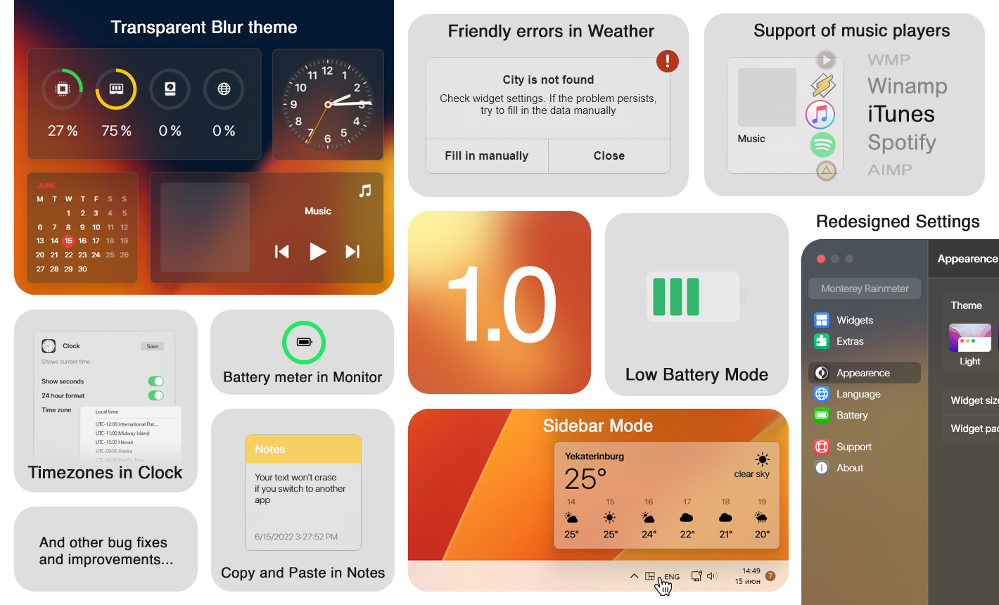
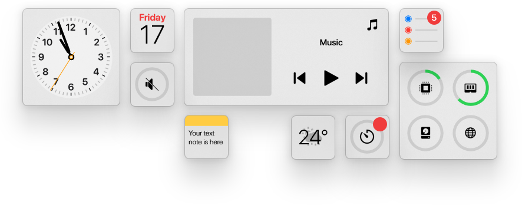
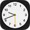
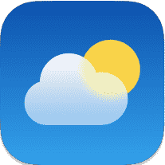
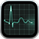
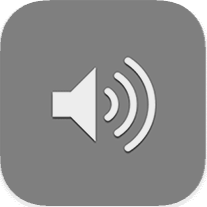
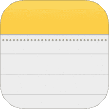
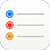
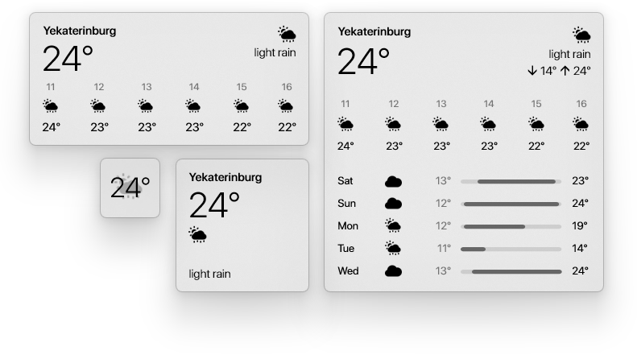

  A MacOS style widget pack for Windows
  
  Inspired by [Big Sur for Rainmeter](https://www.deviantart.com/fediafedia/art/Big-Sur-RC1-for-Rainmeter-846882462)

## Get started

1. Install [Rainmeter](https://www.rainmeter.net/)
2. Get our [latest release](https://github.com/creewick/MontereyRainmeter/releases)
3. Run `Monterey.rmskin`

## Documentation

  
|[User guide](https://github.com/creewick/MontereyRainmeter/wiki/User-guide)|[Send feedback](https://forms.gle/ZtCrtG44SFG8eaQKA)|[Performance Index](https://github.com/creewick/MontereyRainmeter/wiki/Performance-Index)|
|-|-|-|
  

## What will you get

### Widgets

We have 9 widgets available

|Icon|Widget|Description|
|-|-|-|
||**Clock**|Shows current time of any timezone, with or without seconds|
||**Calendar**|Shows current month view, with Monday or Sunday as first day of week|
||**Music**|Allows you to control music player Supported players: WMP, AIMP, CAD, iTunes, Spotify, YouTube, Winamp|
||**Weather**|Shows hourly and daily forecast. You can change the forecast by entering your city name|
||**Monitor**|Shows current CPU, RAM, Disk, Network and Battery levels|
||**Volume**|Allows you to control system volume, volume per app, mute apps and switch output devices|
||**Notes**|Gives you a quick access to your most important text information|
||**Reminders**|A basic to-do list with counter|
||**Timer**|A basic countdown with an alarm sound|
  

### Sizes

Each widget comes in 4 sizes, you can switch between them in the context menu

* 1️⃣ Small
* 2️⃣ Medium
* 3️⃣ Wide
* 4️⃣ Large

### Themes

Widgets appears in one of 5 predefined themes

|Light|Dark|Auto|Color|Blur|
|-|-|-|-|-|
||||||

### Languages

So far we support 4 languages

* Russian
* Ukrainian
* English
* German

## Special thanks

* fediaFedia - Big Sur for Rainmeter
* Socks the Fox - Chameleon plugin
* i2002 - MediaPlayer plugin
* khanhas - AppVolume plugin
* jsmorley - ConfigActive plugin
* fawy - English, Ukrainian translations
* Active Color - helped with pesisting settings
* ikarus1969 - German translation
* Tetrify - Unlock animation idea

## You may also want to
* Center your taskbar buttons with [TaskbarX](https://chrisandriessen.nl/taskbarx)
* Install MacOS-like menu bar - [Droptop Four](https://github.com/Droptop-Four)
* Round your screen corners - [Rounded corners](https://forum.rainmeter.net/viewtopic.php?t=25780#p201917)

