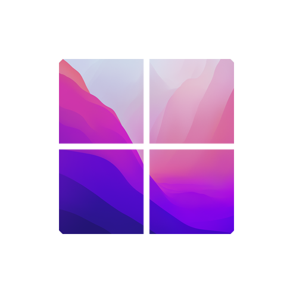
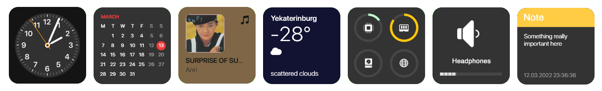
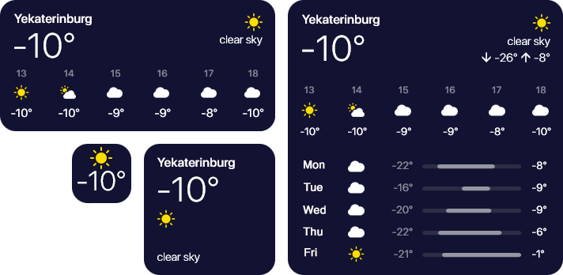
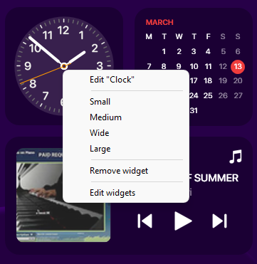

# MontereyRainmeter

A MacOS **Monterey** style widget pack for **Rainmeter**

Inspired by [Big Sur for Rainmeter](https://www.deviantart.com/fediafedia/art/Big-Sur-RC1-for-Rainmeter-846882462)

## Why?

* Lots of customisation
* Accurate design
* Dark theme and color theme
* Effective resources usage

## What will you get?

### Widgets

So far we have 7 widgets available

* Clock
* Calendar
* Music
* Weather
* Resource Monitor
* Volume
* Notes

### Sizes

Each of them comes in 4 sizes, that can be found in context menu

* Small (1x1)
* Medium (2x2)
* Wide (2x4)
* Large (4x4)

### Themes

Widgets appears in one of 3 predefined themes

* Light
* Dark
* Color

Color theme uses average color of your desktop wallpaper

So far we support 3 languages

* Russian
* Ukrainian
* English

## Get started

1. Install [Rainmeter](https://www.rainmeter.net/)
2. Get our [latest release](https://github.com/creewick/MontereyRainmeter/releases)
3. To change widget settings, right-click it and select "Edit"
4. To add widgets and change global settings, right-click any widget and select "Edit widgets"

## You may also want to
* Center your taskbar buttons with [TaskbarX](https://chrisandriessen.nl/taskbarx)
* Install MacOS-like menu bar - [Droptop Four](https://github.com/Droptop-Four)

