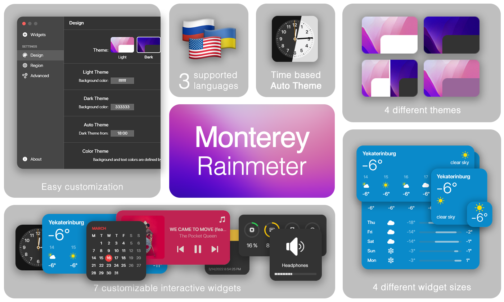
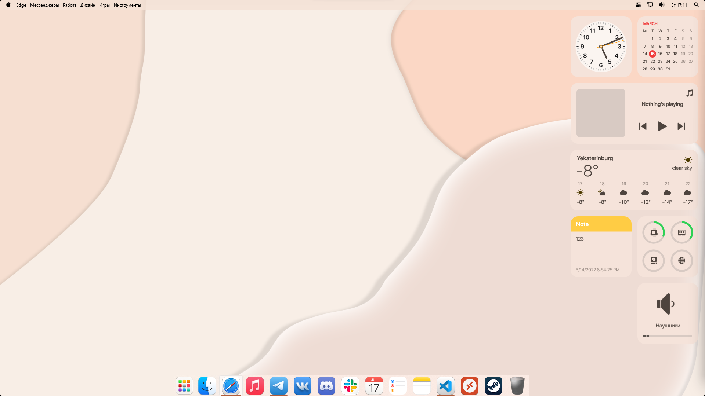

  A MacOS <strong>Monterey</strong> style widget pack for <strong>Rainmeter</strong> on Windows
  
  Inspired by [Big Sur for Rainmeter](https://www.deviantart.com/fediafedia/art/Big-Sur-RC1-for-Rainmeter-846882462)

## Get started

1. Install [Rainmeter](https://www.rainmeter.net/)
2. Get our [latest release](https://github.com/creewick/MontereyRainmeter/releases)
3. Run `Monterey.rmskin`
4. If you're updating, remove the tick from **Apply included layout**

## Documentation

|[User guide](https://github.com/creewick/MontereyRainmeter/wiki/User-guide)|[Troubleshooting](https://github.com/creewick/MontereyRainmeter/wiki/Troubleshooting)|[Performance Index](https://github.com/creewick/MontereyRainmeter/wiki/Performance-Index)|
|-|-|-|

## What will you get

### Widgets

So far we have 7 widgets available

* 🕒 **Clock**

  Shows current time with or without second hand
  
* 🗓️ **Calendar**

  Shows current month view, with Monday or Sunday as first day of week
  
* 🎵 **Music**

  Allows you to control music player, if your player is visible in system flyout 
  Tested on iTunes (web version), Spotify, YouTube

* ☀️ **Weather**

  Shows hourly and daily forecast. 
  You can change the forecast by entering your city name
  

* 📊 **Resource Monitor**

  Shows CPU, RAM, Disk and Network usage in your desired order

* 🎚️ **Volume**

  Allows you to control system volume, volume per app, mute apps and switch output devices

* 📝 **Notes**

  Gives you a quick access to your most important text information

### Sizes

Each of them comes in 4 sizes, you can switch between them in the context menu

* 1️⃣ Small
* 2️⃣ Medium
* 3️⃣ Wide
* 4️⃣ Large

### Themes

Widgets appears in one of 4 predefined themes

* ⬜ Light
* ⬛ Dark
* 🔲 Auto
* 🟪 Color

Color theme uses average color of your desktop wallpaper

### Languages

So far we support 4 languages

* Russian
* Ukrainian
* English
* German

## Special thanks

* fediaFedia - Big Sur for Rainmeter
* Socks the Fox - Chameleon plugin
* i2002 - MediaPlayer plugin
* khanhas - AppVolume plugin
* jsmorley - ConfigActive plugin
* fawy - English, Ukrainian translations
* Active Color - helped with pesisting settings
* ikarus1969 - German translation

## You may also want to
* Center your taskbar buttons with [TaskbarX](https://chrisandriessen.nl/taskbarx)
* Install MacOS-like menu bar - [Droptop Four](https://github.com/Droptop-Four)

